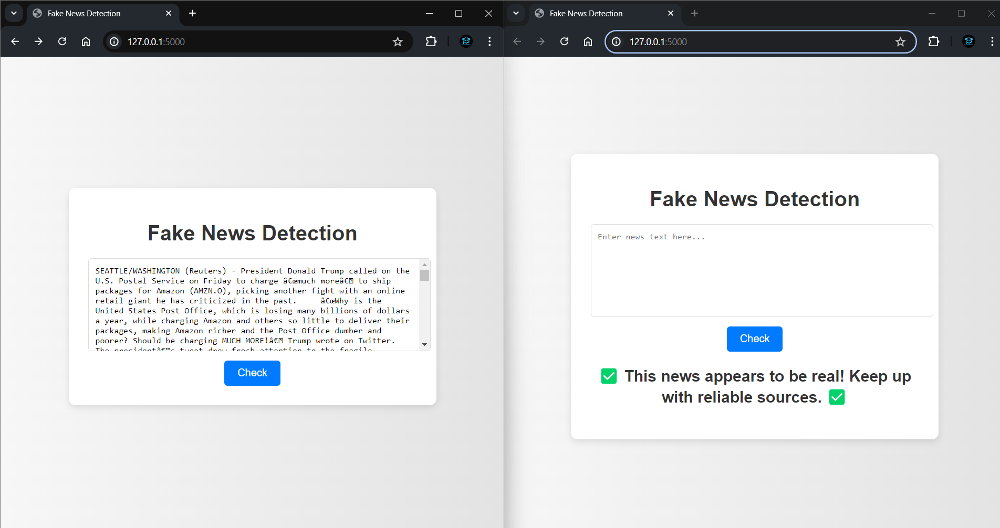

# Fake News Detection Project

## Overview

The Fake News Detection Project aims to accurately identify and classify news articles as either fake or real using machine learning techniques. This project encompasses the development of a web application where users can input news text and receive an instant classification result. The project employs various natural language processing (NLP) methods and machine learning models to achieve high accuracy in detecting fake news.

## Table of Contents

- [Overview](#overview)
- [Technologies Used](#technologies-used)
- [Models Used](#models-used)
- [How It Works](#how-it-works)
- [Datasets Used](#datasets-used)
- [Installation](#installation)
- [Usage](#usage)
- [Outputs](#outputs)
- [Future Scope](#future-scope)

## Technologies Used

The project utilizes a combination of programming languages, frameworks, and libraries to build an efficient and user-friendly fake news detection system.

- **Python:** The primary programming language used for data processing, model training, and backend development.
- **Flask:** A lightweight web framework for developing the web application.
- **HTML/CSS:** Used for building the frontend of the web application.
- **Scikit-learn:** A machine learning library in Python used for model training and evaluation.
- **Pandas:** A data manipulation library in Python used for data preprocessing.
- **NumPy:** A library for numerical computations in Python.

## Models Used

Various machine learning models were explored and implemented to determine the most effective approach for fake news detection. Here's a brief explanation of the models used:

- **Logistic Regression:** A simple yet effective model for binary classification problems.
- **Decision Tree Classifier:** A model that splits the data into subsets based on feature values, forming a tree structure for decision-making.
- **Random Forest Classifier:** An ensemble method that combines multiple decision trees to improve accuracy and reduce overfitting.
- **Gradient Boosting Classifier:** A sequential ensemble method that builds models iteratively, focusing on improving previous iterations.
- **Support Vector Machine (SVM):** A model that finds the hyperplane that best separates the data into classes.
- **Naive Bayes Classifier:** A probabilistic model based on Bayes' theorem, suitable for text classification tasks.

## How It Works

The Fake News Detection Project follows a structured workflow to process and classify news articles:

1. **Data Collection:** The dataset containing news articles labeled as fake or real is collected from reliable sources.
2. **Data Preprocessing:** The collected data is cleaned and preprocessed to remove noise and irrelevant information. This includes steps like tokenization, stop-word removal, and stemming.
3. **Feature Extraction:** Key features are extracted from the text data using techniques like TF-IDF (Term Frequency-Inverse Document Frequency) to convert text into numerical representations.
4. **Model Training:** The processed data is split into training and testing sets. Various machine learning models are trained on the training set to learn patterns and make predictions.
5. **Model Evaluation:** The trained models are evaluated on the testing set to measure their performance using metrics like accuracy, precision, recall, and F1-score.
6. **Web Application Development:** A web application is developed using Flask, where users can input news text and receive real-time classification results.

## Dataset Used

### ISOT Fake News Dataset

The dataset contains two types of articles fake and real News. This dataset was collected from realworld sources; the truthful articles were obtained by crawling articles from Reuters.com (News website). As for the fake news articles, they were collected from different sources. The fake news articles were collected from unreliable websites that were flagged by Politifact (a fact-checking organization in the USA) and Wikipedia. The dataset contains different types of articles on different topics, however, the majority of articles focus on political and World news topics.

The dataset consists of two CSV files. The first file named “True.csv” contains more than 12,600 articles from reuter.com. The second file named “Fake.csv” contains more than 12,600 articles from different fake news outlet resources. Each article contains the following information: article title, text, type and the date the article was published on. To match the fake news data collected for kaggle.com, we focused mostly on collecting articles from 2016 to 2017. The data collected were cleaned and processed, however, the punctuations and mistakes that existed in the fake news were kept in the text.

## Installation

To set up and run the Fake News Detection Project, follow these steps:

1. Clone the repository:
   ```bash
   git clone https://github.com/your-username/fake-news-detection.git
   ```
2. Navigate to the project directory:
   ```bash
   cd fake-news-detection
   ```
3. Install dependencies:
   ```bash
   pip install -r requirements.txt
   ```

## Usage

To start the application and use the fake news detection system:

1. Start the application:
   ```bash
   python app.py
   ```
2. Open a web browser and go to [http://localhost:5000](http://localhost:5000).
3. Enter news text into the provided text box and click "Check" to classify the news as fake or real.

## Outputs

### Output for Real News



_Caption: This output indicates that the news is classified as real._

### Output for Fake News


_Caption: This output indicates that the news is classified as fake._

## Future Scope

The Fake News Detection Project has potential for further improvements and enhancements:

- **Advanced NLP Models:** Implementing advanced NLP models like LSTM and Transformers for more accurate classification.
- **Expanded Dataset:** Expanding the dataset to include more diverse sources and categories of news articles.
- **Enhanced User Interface:** Enhancing the user interface with features for user feedback, real-time updates, and improved usability.
