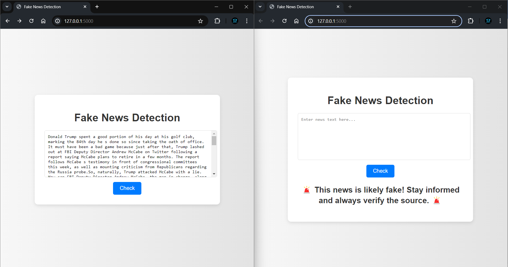

# Fake News Detection Project

## Overview

The Fake News Detection Project is designed to identify and classify news articles as either fake or real using machine learning. It features a web application where users can input news text for instant classification.

## Table of Contents

- [Demo](#demo)
- [Outputs](#outputs)
- [Installation](#installation)
- [Usage](#usage)
- [Technologies Used](#technologies-used)
- [Models Used](#models-used)
- [Future Scope](#future-scope)

## Demo

 

_Caption: The first image shows the precision, confusion matrix, and classification report for Logistic Regression, Decision Tree Classifier, and Random Forest Classifier._

<div style="padding: 5px;">
    
</div>

_Caption: The second image shows the precision, confusion matrix, and classification report for Gradient Boosting Classifier, Support Vector Machine (SVM), and Naive Bayes Classifier._

## Outputs

### Output for Real News


_This output shows the classification result for a real news article. The model predicts with high confidence that the input text is genuine news, as indicated by the probability score displayed._

### Output for Fake News



_This output demonstrates the classification result for a fake news article. The model accurately identifies the input text as false information, with a high probability score reflecting this prediction._

## Installation

1. Clone the repository:
   ```bash
   git clone https://github.com/your-username/fake-news-detection.git
   ```
2. Navigate to the project directory:
   ```bash
    Copy code
    cd fake-news-detection
   ```
3. Install dependencies:
   ```bash
   Copy code
   pip install -r requirements.txt
   ```

## Usage

- Start the application:
  ```bashS
  Copy code
  python app.py
  ```
- Open a web browser and go to http://localhost:5000.
- Enter news text into the provided text box and click "Check" to classify the news as fake or real.

## Technologies Used

- Python
- Flask
- HTML/CSS
- Scikit-learn
- Pandas
- Numpy

## Models Used

This project explores different machine learning models for fake news detection. Here's a brief explanation of some models used:

- **Logistic Regression:** A widely used and interpretable model for classification problems.
- **Decision Tree Classifier:** A tree-based model that learns decision rules for classification.
- **Random Forest Classifier:** Combines multiple decision trees for improved accuracy and robustness.
- **Gradient Boosting Classifier:** Sequentially learns models to improve on previous ones.
- **Support Vector Machine (SVM):** Creates a hyperplane to separate real and fake news data points.
- **Naive Bayes Classifier:** A probabilistic model based on Bayes' theorem for efficient classification.

The choice of model depends on factors like dataset size, interpretability needs, and desired accuracy. We'll be evaluating these models and potentially explore more complex models like LSTMs and Transformers in the future, which leverage deep learning architectures for potentially higher accuracy in handling complex text data.

## Future Scope

- Implement advanced NLP models like LSTM and Transformers for more accurate classification.
- Expand the dataset to include more diverse sources and categories of news articles.
- Enhance user interface with features for user feedback and real-time updates.
